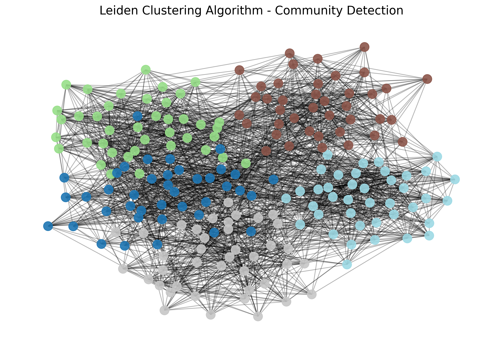

# Leiden Clustering Proof of Concept (PoC)

This repository demonstrates the implementation of the **Leiden Algorithm** for community detection within complex networks. It showcases how to generate synthetic graph data, bridge standard network libraries (`NetworkX`) with high-performance C++ backend engines (`igraph`), and visualize the resulting modular communities.

## 🧠 System Architecture

The pipeline consists of two primary modules:
1.  **`data_generator.py`**: Generates a synthetic, planted partition graph. This simulates a real-world scenario with distinct "hidden" communities (e.g., echo chambers in social networks or thematic groups in datasets).
2.  **`leiden_clustering.py`**: The core analytical engine. It converts the data to `igraph` format for speed, executes the Leiden algorithm to maximize modularity, and visualizes the detected clusters.

## 📊 Leiden Communities Visualization

Understanding the Visual Output
Nodes (Circles): Represent the individual entities within the network.

Edges (Lines): Indicate the relationships or connections established between these entities.

Colors (Communities): Each distinct color represents a unique community autonomously detected by the Leiden algorithm. Nodes sharing the same color possess a significantly higher density of internal connections (modularity) compared to their connections with the rest of the network.

Spatial Grouping: The visualization utilizes a force-directed algorithm (Spring Layout). This layout naturally pulls highly connected nodes closer together while pushing disparate groups apart, visually validating the mathematical clusters found by the algorithm.


## 🚀 Quick Start

Follow these steps to replicate the environment and run the clustering pipeline on your local machine.

### 1. Clone the Repository
```bash
git clone [https://github.com/YOUR-USERNAME/Leiden-Clustering-PoC.git](https://github.com/YOUR-USERNAME/Leiden-Clustering-PoC.git)
cd Leiden-Clustering-PoC
```

### 2. Set Up the Virtual Environment

```bash
python -m venv venv
```
#### On Windows
```bash
.\venv\Scripts\activate
```
#### On Mac/Linux
```bash
source venv/bin/activate
```


### 3. Install Dependencies

```bash
pip install -r requirements.txt
```

### 4. Run the Pipeline

```bash
python data_generator.py
```

Then, execute the Leiden algorithm to detect and visualize the communities:

```bash
python leiden_clustering.py
```